Sending a Message in Selerix Engage via API
-

In this tutorial you'll learn how to create a message via API Requests. I am using the Postman platform to send and receive the requests and I'll be starting from scratch, meaning the user will need to authenticate, gather criteria, and build an audience for the message before actually sending it. I will also cover some extra features involved with sending a message such as estimating the audience and including an image in the message.

[Authentication (POST request)](https://selerix.postman.co/collections/7428926-199073a3-05bb-48ce-b308-a245a1c6dee4?version=latest&workspace=f67e800c-2124-4067-823b-bd0697d079fc#12d5beeb-2d91-438a-96e5-51ec063492a0)
-

The first step in connecting with Selerix Engage is to send a **POST** request to authenticate the user to work within the Engage environment via the API connection. 

The Body of the post will need to include the Benefits Pulse **Username** and **Password**:

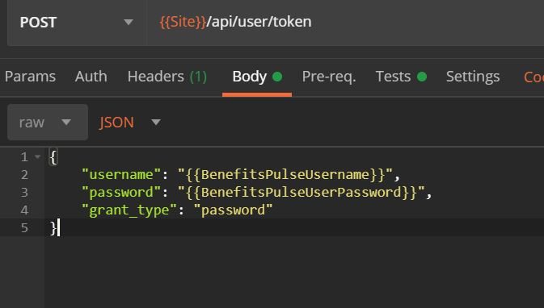

If the **POST** is successful, the response will send back a status of 200 and also include an access token that allows access for 24 hours. Once the 24 hours is up, this will need to be renewed by sending the **Authentication** request again before any other calls will be accepted: 

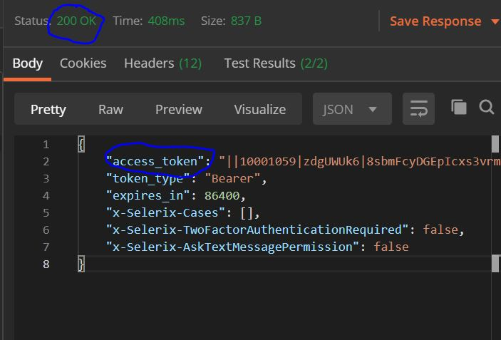
 
[Get Criteria (Get Requests)](https://selerix.postman.co/collections/7428926-199073a3-05bb-48ce-b308-a245a1c6dee4?version=latest&workspace=f67e800c-2124-4067-823b-bd0697d079fc#f50ef8dd-a89f-4b74-8f48-ae04fdba7b32)
-
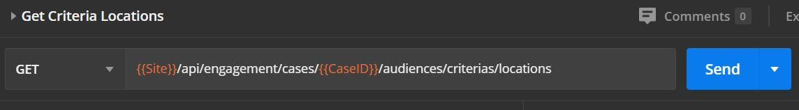

Once the user is authenticated, you will need to begin gathering **Criteria** to help filter your audience by sending multiple **GET** requests. Criteria are unique from case to case and will need to be gathered any time you want to create a new **Audience** within Engage. 

In the Engage admin environment, you setup the **Criteria** for your **Audience** using check boxes shown here:

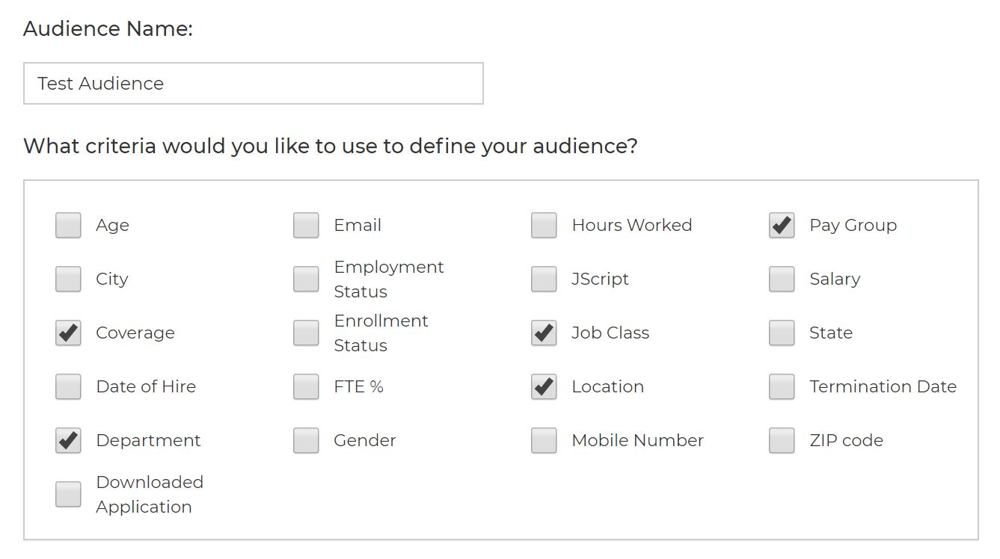

You can do the same thing via API, but you'll first need to gather all possible **Criteria** on the case. When gathering, you'll need to send multiple **GET** requests via an API client: 

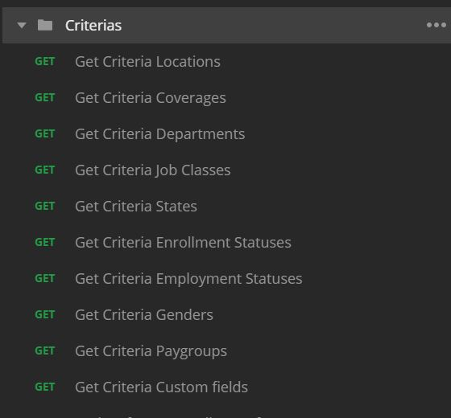

[Manage Audience (Various Requests)](https://selerix.postman.co/collections/7428926-199073a3-05bb-48ce-b308-a245a1c6dee4?version=latest&workspace=f67e800c-2124-4067-823b-bd0697d079fc#7dd14535-c8e6-4888-b220-201a008f900c)
-
Once your **Criteria** is gathered, you can now manage the **Audience** for your Engage **Campaign**.  

### [Add Target Audience to Case (PUT Request)](https://selerix.postman.co/collections/7428926-199073a3-05bb-48ce-b308-a245a1c6dee4?version=latest&workspace=f67e800c-2124-4067-823b-bd0697d079fc#bb44bf85-e937-495b-b928-6fca6843ae46)

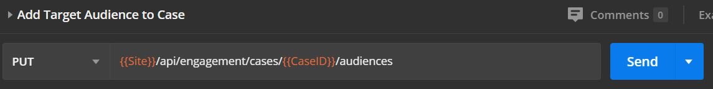

The first step in managing your **Target Audience** is to add it to the case. The body of the request will include the **Criteria** that you want to make up the **Audience**. Think of the **Criteria** as a filter, it will allow you to create an **Audience** of only the members you want to communicate with, such as all employees in the *Full Time* **Job Class** that do not have a *Completed* **Enrollment Status**. If the request is successful, it will return a status of 200 and the response will include which **Criteria** are enabled, and the values for it:   

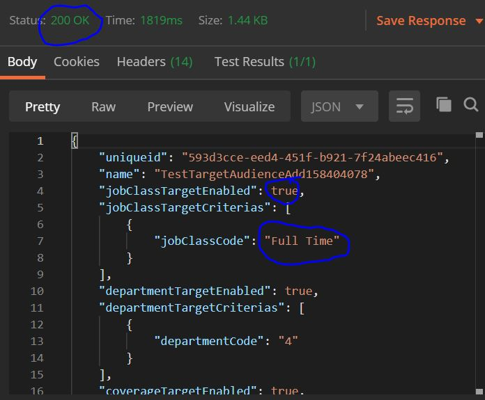

### [Update Target Audience (POST Request)](https://selerix.postman.co/collections/7428926-199073a3-05bb-48ce-b308-a245a1c6dee4?version=latest&workspace=f67e800c-2124-4067-823b-bd0697d079fc#3792ee76-e791-4868-bc2d-7552e0d45ef9)

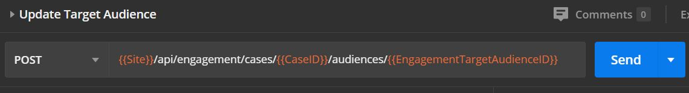

Once the **Audience** has been created, you can also make changes to it via the **Update Target Audience** request. The body of this request and response is the same format as the **Add Target Audience to Case** request, except it will include any changes you make to the existing **Audience**. 

### [Estimate Target Audience by Unique ID (GET Request)](https://selerix.postman.co/collections/7428926-199073a3-05bb-48ce-b308-a245a1c6dee4?version=latest&workspace=f67e800c-2124-4067-823b-bd0697d079fc#32a9f9b8-28c2-41ef-82ed-e2994311358d)

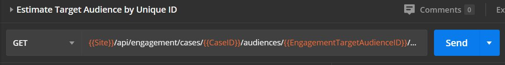

This request will return a count for the amount of employees that are included in the **Audience**. This is useful for double checking this is reaching the number of employees that is expected. A successful request will return a status of 200 and an integer representing the number of employees within the **Audience**. 

Manage Messages (Various Requests)
-
At this point, you've gathered **Criteria** from the case and used it to build an **Audience** for your **Message**. Now we'll go over the various requests that can be used to create, update, and enable messages to be sent. 

### [Add Message to Case (PUT Request)](https://selerix.postman.co/collections/7428926-199073a3-05bb-48ce-b308-a245a1c6dee4?version=latest&workspace=f67e800c-2124-4067-823b-bd0697d079fc#6571e89d-912f-46f4-8cd5-e0fdaaa99feb)

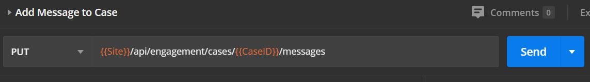

This creates the **Message** and is the first request you'll want to run once your **Audience** is built. The **Message Name** is the only required field at this point, although you won't be allowed to enable the **Message** to be sent without a **Delivery Date**. A successful Request will receive a status of 200 and the Response body will include all of the fields and their values related to the message:

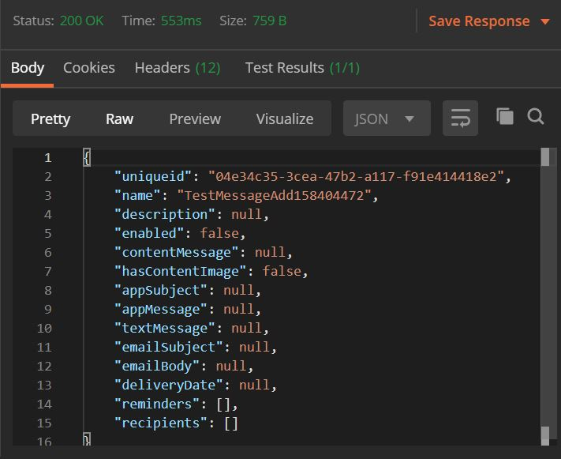

### [Update Message (POST Request)](https://selerix.postman.co/collections/7428926-199073a3-05bb-48ce-b308-a245a1c6dee4?version=latest&workspace=f67e800c-2124-4067-823b-bd0697d079fc#4bee7a47-1e59-4878-85bf-b56704f12cce)

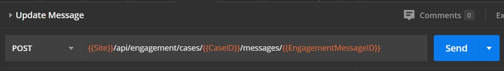

This works like updating the **Target Audience**. Once the **Message** has been created, the update request can be used to make any needed changes to the **Message** after the fact. The body of this request and response is the same format as the **Add Message to Case** request, except it will include any changes you make to the existing **Message**. 

### [Upload Message Content Image (POST Request)](https://selerix.postman.co/collections/7428926-199073a3-05bb-48ce-b308-a245a1c6dee4?version=latest&workspace=f67e800c-2124-4067-823b-bd0697d079fc#c5d6ed5f-ac54-4880-8f7f-93ba99da6d1f)

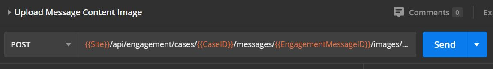

This will allow you to add an image that can be sent as content within the specified **Message**. The  image is uploaded to the case via the *file_key*. As seen in the image below, Postman allows you to upload the image in the Body section of the request:

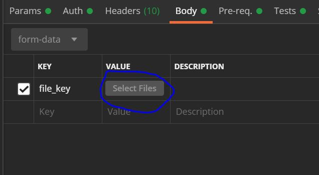

### [Toggle Message Enabled (POST Request)](https://selerix.postman.co/collections/7428926-199073a3-05bb-48ce-b308-a245a1c6dee4?version=latest&workspace=f67e800c-2124-4067-823b-bd0697d079fc#5c934459-db72-4d79-97f0-9d376519bd10)

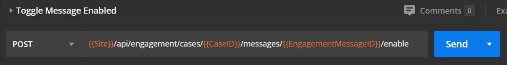

This will allow you to enable the **Message** to send if you haven't already done so when it was first created. There must be a delivery date for the message for this request to work. A successful request will receive a status of 200. Once the message is enabled, it will be sent out to the specified **Audience** on the selected delivery date. 
